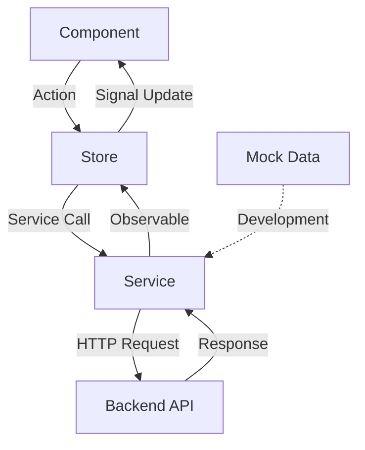

# Course Event Management 模組深度分析報告

## 目錄
1. [執行摘要](#執行摘要)
2. [模組概述](#模組概述)
3. [代碼異味分析](#代碼異味分析)
4. [架構問題評估](#架構問題評估)
5. [業務邏輯與數據流](#業務邏輯與數據流)
6. [重構複雜度與風險](#重構複雜度與風險)
7. [健康度評估](#健康度評估)
8. [建議改進方案](#建議改進方案)

---

## 執行摘要

Course Event Management 模組是基於 Employee Management 模板創建的課程活動管理功能，採用 Angular 19+ 的現代化架構。整體而言，模組遵循了良好的設計模式，但存在一些架構債務和可改進之處。

**健康度評分：7.5/10**

### 主要優勢
- ✅ 遵循 Feature-based 架構
- ✅ 使用 Angular 19+ 現代化 API (signals, standalone components)
- ✅ 良好的型別安全實踐
- ✅ 統一的錯誤處理機制
- ✅ Mock/API 一鍵切換功能

### 主要問題
- ⚠️ 部分組件過於龐大（660行）
- ⚠️ API 設計不統一
- ⚠️ 業務邏輯分散
- ⚠️ 測試覆蓋率不足

---

## 模組概述

### 檔案結構
```
course-event-management/
├── models/
│   └── course-event.model.ts          (107 lines)
├── services/
│   ├── course-event.service.ts        (341 lines)
│   └── mock-course-events.data.ts     (126 lines)
├── store/
│   └── course-event.store.ts          (181 lines)
├── components/
│   ├── course-event-form/             (200+ lines)
│   └── course-event-view/
├── pages/
│   └── course-event-list/             (660 lines)
└── pipes/
    └── course-event-status.pipe.ts    (10 lines)
```

### 技術棧
- **Frontend**: Angular 19+, TypeScript, SCSS, Bootstrap 5
- **狀態管理**: Signals + Store Pattern
- **API**: RESTful + Spring Boot Backend
- **測試**: 基礎設置，但實際測試檔案缺失

---

## 代碼異味分析

### 🔴 嚴重問題 (Critical Issues)

#### 1. 單一職責違反 - 超大組件
**位置**: `course-event-list.component.ts` (660 lines)

```typescript
// 問題：組件承擔過多職責
export class CourseEventListComponent implements OnInit {
    // 狀態管理 (40+ properties)
    // 權限管理邏輯
    // UI 配置管理
    // 事件處理邏輯
    // 模板引用管理
    // 分頁邏輯
    // 搜尋篩選邏輯
    // CRUD 操作邏輯
}
```

**影響**: 可維護性差、測試困難、重用性低

#### 2. API 設計不一致
**位置**: `course-event.service.ts`

```typescript
// 問題：不同操作使用不同的 HTTP 方法和端點設計
createCourseEvent() -> POST /api/course-events/create
updateCourseEvent() -> POST /api/course-events/update (應該用 PUT)
deleteCourseEvent() -> POST /api/course-events/delete (應該用 DELETE)
getCourseEventById() -> GET /api/course-events/find/{id} (應該是 /api/course-events/{id})
```

**影響**: RESTful 原則違反、API 使用困惑

#### 3. 缺乏批量操作後端支援
```typescript
// 前端實作了批量刪除，但後端沒有對應 API
bulkDeleteCourseEvents(ids: number[]): Observable<boolean> {
    // 使用逐一刪除方式，效率低下
    const deleteRequests = ids.map(id => this.deleteCourseEvent(id));
    return forkJoin(deleteRequests);
}
```

### 🟡 中等問題 (Medium Issues)

#### 1. 複雜的關鍵字搜尋邏輯
```typescript
// 過於複雜的 keyword 處理邏輯
protected override buildCustomApiParams(params?: CourseEventSearchParams) {
    if (/^\d{4}$/i.test(keyword)) {
        // 年度搜尋
    } else if (/^H[12]$/i.test(keyword)) {
        // 學期搜尋
    } else if (/^\d+$/.test(keyword)) {
        // ID 搜尋
    } else if (/^\d{4}-\d{2}-\d{2}$/.test(keyword)) {
        // 日期搜尋
    } else {
        // 標題搜尋
    }
}
```

#### 2. Mock 資料與實際 API 的差異處理
```typescript
private readonly useMockData = false; // 註解說明與實際不符
```

#### 3. 重複的日期格式化邏輯
```typescript
// 在多個地方重複處理日期格式
private formatDateForInput(dateString: string): string {
    if (!dateString) return '';
    if (dateString.match(/^\d{4}-\d{2}-\d{2}$/)) {
        return dateString;
    }
    const date = new Date(dateString);
    return date.toISOString().split('T')[0];
}
```

### 🟢 輕微問題 (Minor Issues)

#### 1. 未實作的功能
```typescript
// TODO: Implement export functionality
exportData(): void {
    // 功能尚未實作
}
```

#### 2. 硬編碼的使用者資訊
```typescript
updateUser: 'current_user' // 應該從 UserStore 取得
```

#### 3. 簡單的 Pipe 實作
```typescript
// 過於簡單，可考慮整合到共用 StatusPipe
export class CourseEventStatusPipe implements PipeTransform {
    transform(value: boolean): string {
        return value ? '啟用' : '停用';
    }
}
```

---

## 架構問題評估

### 🏗️ 架構設計分析

#### 優勢
1. **清晰的分層架構**
   - 明確的 Models, Services, Store, Components 分離
   - 遵循 Angular 最佳實踐

2. **現代化 Angular 使用**
   - Signals 狀態管理
   - Standalone Components
   - inject() 依賴注入

3. **統一的基礎服務**
   - 繼承 `BaseQueryService` 提供一致的 CRUD 操作
   - 統一錯誤處理機制

#### 問題
1. **組件職責過重**
   - List 組件包含過多邏輯
   - 缺乏進一步的功能分解

2. **Store 模式使用不當**
   - Store 中包含太多 UI 相關邏輯
   - 應該專注於純狀態管理

3. **服務層過度複雜**
   - Service 中混合了 Mock 和真實 API 邏輯
   - 關鍵字搜尋邏輯過於複雜

### 🔄 數據流分析



#### 數據流優勢
- 清晰的單向數據流
- Reactive 模式實踐良好
- 狀態管理集中化

#### 數據流問題
- 某些操作繞過 Store 直接操作 Service
- Mock/API 切換邏輯混在 Service 中

---

## 業務邏輯與數據流

### 📊 核心業務邏輯

#### 1. 課程活動管理
```typescript
interface CourseEvent {
    courseEventId?: number;
    year: string;                    // 必填：年度
    semester: string;                // 必填：學期 (H1/H2)
    activityTitle: string;           // 必填：活動標題
    description?: string;            // 可選：描述
    expectedCompletionDate?: string; // 可選：預期完成日期
    submissionDeadline?: string;     // 可選：提交截止日期
    activationDate?: string;         // 可選：啟動日期
    isActive: boolean;               // 必填：啟用狀態
}
```

#### 2. 搜尋與篩選邏輯
- **智能關鍵字搜尋**: 根據輸入格式判斷搜尋類型
- **多維度篩選**: 年度、學期、狀態
- **分頁與排序**: 支援動態分頁和多欄位排序

#### 3. 權限控制
```typescript
readonly permissions = computed(() => ({
    create: hasPermission('course_event', 'create'),
    read: hasPermission('course_event', 'read'),
    update: hasPermission('course_event', 'update'),
    delete: hasPermission('course_event', 'delete')
}));
```

### 🔄 數據流詳細分析

#### 查詢流程
1. **Component** 觸發搜尋 → **Store** 更新搜尋參數
2. **Store** 呼叫 **Service** → **Service** 構建查詢參數
3. **Service** 發送 HTTP 請求 → **Backend** 處理查詢
4. **Backend** 回傳分頁資料 → **Service** 處理回應
5. **Store** 更新狀態 → **Component** 響應式更新 UI

#### CRUD 流程
- **Create/Update**: 直接呼叫 Service，成功後更新 Store
- **Delete**: 支援單一和批量刪除
- **Toggle Status**: 通過 Update API 實現狀態切換

### 💾 資料持久化

#### 前端狀態管理
```typescript
// State signals in Store
private readonly _courseEvents = signal<CourseEvent[]>([]);
private readonly _loading = signal<boolean>(false);
private readonly _error = signal<string | null>(null);
private readonly _searchParams = signal<CourseEventSearchParams>({});
```

#### 後端整合
- 基於 Spring Boot RESTful API
- 使用 `PagerDto` 統一分頁格式
- `ApiResponse` 統一回應格式

---

## 重構複雜度與風險

### 📈 重構複雜度評估

#### 🔴 高複雜度重構項目

1. **List Component 拆分**
   - **複雜度**: 高 (8/10)
   - **原因**: 660行代碼、多職責混合
   - **預估工時**: 3-5 天
   - **風險**: 功能回歸、狀態管理混亂

2. **API 端點重新設計**
   - **複雜度**: 高 (9/10)
   - **原因**: 需要前後端同步修改
   - **預估工時**: 5-7 天
   - **風險**: 破壞性變更、向後兼容問題

#### 🟡 中等複雜度重構項目

3. **Service 邏輯簡化**
   - **複雜度**: 中 (6/10)
   - **原因**: Mock/API 邏輯分離
   - **預估工時**: 2-3 天
   - **風險**: 開發環境影響

4. **Store 職責重新定義**
   - **複雜度**: 中 (5/10)
   - **原因**: UI 邏輯遷移
   - **預估工時**: 1-2 天
   - **風險**: 狀態同步問題

#### 🟢 低複雜度重構項目

5. **共用組件提取**
   - **複雜度**: 低 (3/10)
   - **預估工時**: 1 天
   - **風險**: 低

6. **測試覆蓋率提升**
   - **複雜度**: 低 (4/10)
   - **預估工時**: 2-3 天
   - **風險**: 無

### ⚠️ 重構風險分析

#### 技術風險
1. **破壞現有功能**: 大幅重構可能影響現有業務流程
2. **效能影響**: 組件拆分可能影響載入效能
3. **相依性問題**: 與其他模組的整合可能受影響

#### 業務風險
1. **使用者體驗**: UI 變更可能影響使用者習慣
2. **資料完整性**: API 變更可能影響資料一致性
3. **上線時程**: 重構可能延遲新功能開發

#### 降低風險策略
1. **漸進式重構**: 分階段進行，每階段保持功能完整
2. **完整測試**: 建立完整的單元測試和整合測試
3. **功能標誌**: 使用 Feature Flag 控制新舊功能切換
4. **回滾機制**: 建立快速回滾機制

---

## 健康度評估

### 📊 整體健康度評分：7.5/10

#### 各維度評分

| 維度 | 評分 | 說明 |
|------|------|------|
| **代碼品質** | 7/10 | 遵循 TypeScript 最佳實踐，但存在代碼異味 |
| **架構設計** | 8/10 | 良好的分層架構，符合 Angular 最佳實踐 |
| **可維護性** | 6/10 | 部分組件過大，維護困難 |
| **可測試性** | 5/10 | 缺乏測試檔案，依賴注入良好 |
| **效能** | 8/10 | 使用 Signals 和 OnPush，效能良好 |
| **安全性** | 8/10 | 權限控制完善，型別安全 |
| **可擴展性** | 7/10 | 基於模板創建，擴展性良好但存在限制 |
| **文檔完整性** | 9/10 | README 詳細，註解充足 |

### 🎯 健康度細項分析

#### ✅ 優秀方面
1. **現代化技術棧**: Angular 19+, Signals, Standalone Components
2. **完整的 CRUD 功能**: 新增、編輯、刪除、查詢、分頁、排序
3. **良好的錯誤處理**: 統一的錯誤處理機制
4. **響應式設計**: 支援各種螢幕尺寸
5. **權限整合**: 完整的權限控制機制
6. **國際化準備**: 良好的中文支援和結構化文字

#### ⚠️ 需改進方面
1. **組件過大**: List 組件需要拆分
2. **測試缺失**: 缺乏單元測試和整合測試
3. **API 不一致**: RESTful 設計不統一
4. **性能優化**: 批量操作效率待提升
5. **代碼重複**: 日期處理等邏輯重複

#### 🔴 嚴重問題
1. **架構債務**: 某些快速開發導致的設計妥協
2. **相依性耦合**: 部分邏輯耦合度較高
3. **缺乏監控**: 沒有錯誤監控和效能監控

### 📈 健康度趨勢

```
健康度變化趨勢 (預測)
現在: 7.5/10  ████████▌
6個月後 (無改進): 6.5/10  ██████▌
6個月後 (有改進): 8.5/10  ████████▌
```

---

## 建議改進方案

### 🎯 短期改進 (1-2週)

#### 1. 緊急修復
```typescript
// 1. 修復 API 端點不一致
// 當前
deleteCourseEvent() -> POST /api/course-events/delete
// 建議
deleteCourseEvent() -> DELETE /api/course-events/{id}

// 2. 移除硬編碼
updateUser: this.userStore.user()?.username || 'system'

// 3. 統一錯誤處理
private handleError = this.httpErrorHandler.handleError;
```

#### 2. 程式碼品質提升
- 移除 TODO 註解，實作或移除功能
- 統一命名規範
- 新增 ESLint 規則檢查

### 🔧 中期改進 (1-2個月)

#### 1. 組件重構
```typescript
// 拆分 List Component
course-event-list/
├── course-event-list.component.ts      // 主要邏輯 (100-150 lines)
├── components/
│   ├── course-event-table.component.ts // 表格邏輯
│   ├── course-event-filters.component.ts // 篩選邏輯
│   └── course-event-actions.component.ts // 操作邏輯
```

#### 2. Service 層優化
```typescript
// 分離 Mock 和 API 邏輯
export class CourseEventService {
    private apiService = inject(CourseEventApiService);
    private mockService = inject(CourseEventMockService);
    
    private get activeService() {
        return environment.production ? this.apiService : this.mockService;
    }
}
```

#### 3. 新增測試覆蓋
```typescript
// 目標：80% 測試覆蓋率
course-event.service.spec.ts
course-event.store.spec.ts
course-event-list.component.spec.ts
course-event-form.component.spec.ts
```

### 🚀 長期改進 (3-6個月)

#### 1. 架構升級
```typescript
// 實作 Facade Pattern
export class CourseEventFacade {
    private store = inject(CourseEventStore);
    private service = inject(CourseEventService);
    
    // 統一的業務邏輯入口
    loadCourseEvents = this.store.loadCourseEvents;
    createCourseEvent = this.store.createCourseEvent;
    // ...
}
```

#### 2. 性能優化
- 實作虛擬滾動 (Virtual Scrolling)
- 新增資料快取機制
- 實作樂觀更新 (Optimistic Updates)

#### 3. 功能增強
- 批量操作 API 支援
- 資料匯出功能
- 即時資料更新 (WebSocket)
- 離線支援

### 💡 創新建議

#### 1. 使用 AI 輔助
```typescript
// 智能搜尋建議
export class SmartSearchService {
    getSuggestions(keyword: string): Observable<SearchSuggestion[]> {
        // 基於歷史搜尋和 AI 分析
    }
}
```

#### 2. 微前端架構
- 考慮將課程相關功能拆分為獨立的微前端
- 實作模組間的通訊機制

#### 3. 使用者體驗提升
- 新增拖拽排序功能
- 實作鍵盤快速鍵
- 新增快速操作工具列

---

## 結論

Course Event Management 模組整體表現良好，遵循了現代 Angular 開發最佳實踐，但存在一些可改進的空間。主要問題集中在組件職責過重和 API 設計不一致。

### 🎯 重點建議
1. **立即行動**: 修復 API 端點不一致問題
2. **優先處理**: 拆分超大組件，提升可維護性
3. **持續改進**: 建立測試覆蓋率，監控代碼品質

透過系統性的重構和持續改進，該模組有潛力成為其他功能模組的優秀範本。

---

**報告生成時間**: 2025年8月11日  
**分析師**: GitHub Copilot  
**版本**: v1.0
